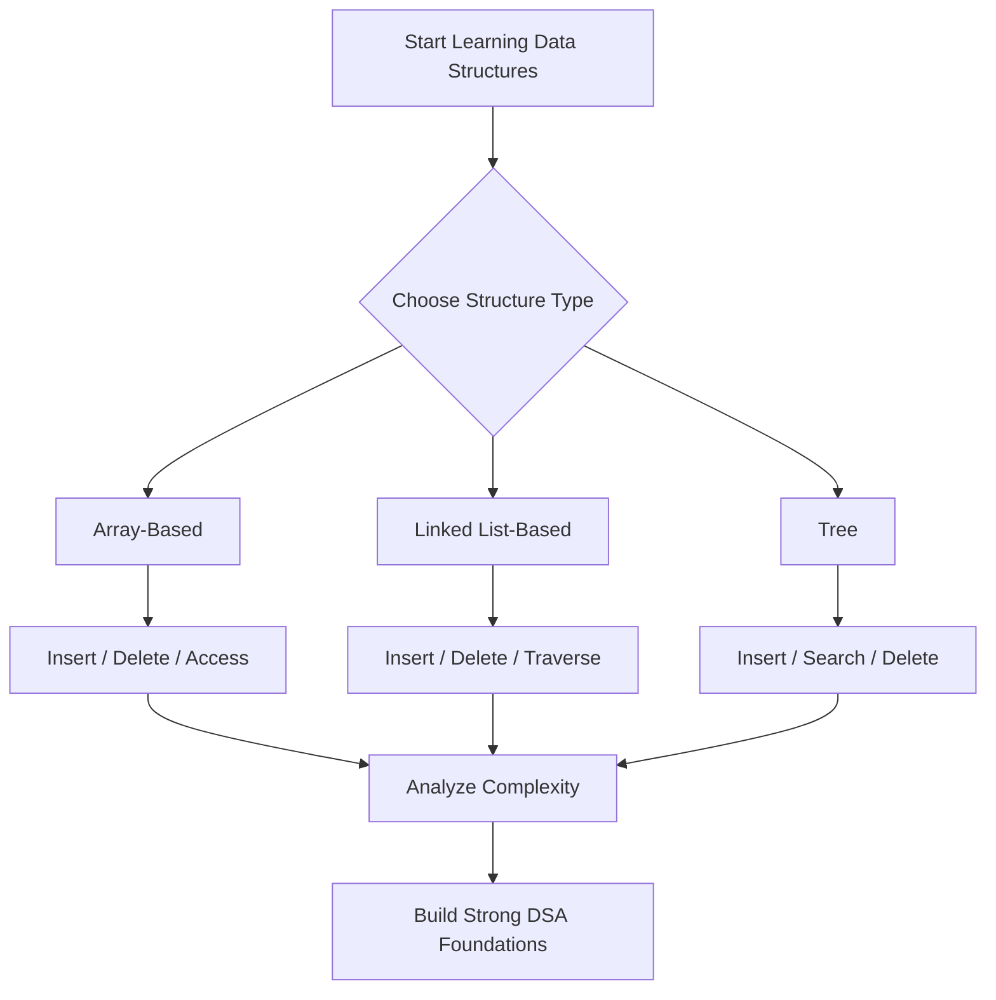
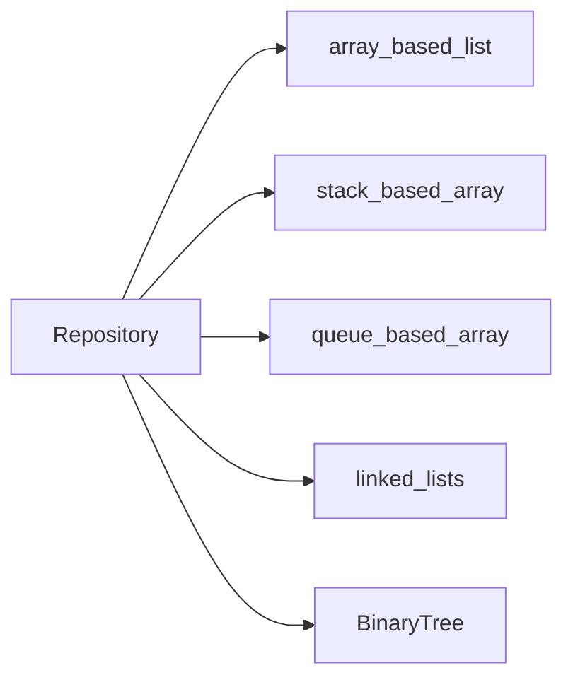

# 🧠 Data-Structures-CPP

[](https://github.com/Farouk0Elsayed/Data-Structures-CPP)
[](https://isocpp.org/)
[](/LICENSE)
[](https://github.com/Farouk0Elsayed/Data-Structures-CPP)

> A clean, from-scratch C++ implementation of core data structures for learning, practice, and interview preparation.

---

## 📘 Overview

**Data-Structures-CPP** is a comprehensive educational repository that implements fundamental data structures without relying on STL containers for core behavior.  
It is designed to help learners understand *how* each structure works internally and practice common operations with clear, template-based C++ code.

---

## ✨ Features

| Category | Highlights |
|---|---|
| 📦 Array-Based Structures | Dynamic list behavior, LIFO stack, FIFO queue, circular queue buffer |
| 🔗 Linked Structures | Singly, circular, doubly linked lists + linked queue and stack |
| 🌳 Trees | Binary Search Tree with insert/search/delete + traversals |
| 🧩 Generic Design | Most structures are implemented as C++ templates |
| 🎯 Learning Focus | Covers insertion, deletion, traversal, searching, and utility operations |

---

## 🗂️ Complete Data Structures Catalog

| # | Data Structure | Category | File |
|---:|---|---|---|
| 1 | Array Based List | Array-Based | `array_based_list/array_based_list.h` |
| 2 | Stack Based Array | Array-Based | `stack_based_array/stackADT.h` |
| 3 | Queue Based Array | Array-Based | `queue_based_array/queueAdt.h` |
| 4 | Circular Queue Based Array | Array-Based | `queue_based_array/CircularQueueAdt.h` |
| 5 | Singly Linked List | Linked List-Based | `linked_lists/list.h` |
| 6 | Circular Linked List | Linked List-Based | `linked_lists/CircularLinkedLlist.h` |
| 7 | Doubly Linked List | Linked List-Based | `linked_lists/DoublyLinkedList.h` |
| 8 | Queue Linked List | Linked List-Based | `linked_lists/QueueLinkedList.h` |
| 9 | Stack Linked List | Linked List-Based | `linked_lists/StackLinkedList.h` |
| 10 | Binary Tree (BST-style operations) | Tree Structures | `BinaryTree/Binary_Tree.h` |

---

## ⏱️ Time Complexity Comparison

> **Note:** Complexities are standard expected averages/worst-cases for these data structures and operations.

| Data Structure | Access | Search | Insert | Delete |
|---|---:|---:|---:|---:|
| Array Based List | `O(1)` | `O(n)` | `O(n)` | `O(n)` |
| Stack (Array / Linked) | `O(1)` (top) | `O(n)` | `O(1)` (push) | `O(1)` (pop) |
| Queue (Array / Linked) | `O(1)` (front/back) | `O(n)` | `O(1)` (enqueue) | `O(1)` (dequeue) |
| Circular Queue | `O(1)` (front/back) | `O(n)` | `O(1)` | `O(1)` |
| Singly Linked List | `O(n)` | `O(n)` | `O(1)`* / `O(n)` | `O(1)`* / `O(n)` |
| Doubly Linked List | `O(n)` | `O(n)` | `O(1)`* / `O(n)` | `O(1)`* / `O(n)` |
| Circular Linked List | `O(n)` | `O(n)` | `O(1)`* / `O(n)` | `O(1)`* / `O(n)` |
| Binary Tree (BST) | `O(h)` | `O(h)` | `O(h)` | `O(h)` |

<details>
<summary><strong>Complexity assumptions</strong></summary>

- `h` is tree height (`O(log n)` average for balanced trees, `O(n)` worst-case for skewed trees).
- `*` indicates operations that can be constant-time when a direct node position/pointer is already known.

</details>

---

## 🧱 Project Structure

```text
Data-Structures-CPP/
├── array_based_list/
│   └── array_based_list.h
├── stack_based_array/
│   └── stackADT.h
├── queue_based_array/
│   ├── queueAdt.h
│   └── CircularQueueAdt.h
├── linked_lists/
│   ├── list.h
│   ├── CircularLinkedLlist.h
│   ├── DoublyLinkedList.h
│   ├── QueueLinkedList.h
│   └── StackLinkedList.h
├── BinaryTree/
│   └── Binary_Tree.h
├── LICENSE
└── README.md
```

---

## 🚀 Quick Start

### 1) Clone the repository

```bash
git clone https://github.com/Farouk0Elsayed/Data-Structures-CPP.git
cd Data-Structures-CPP
```

### 2) Create a simple test file

```cpp
#include "array_based_list/array_based_list.h"
#include <iostream>
using namespace std;

int main() {
    arrayListType<int> arr(10);
    arr.pushback(5);
    arr.pushback(10);
    arr.print();
}
```

### 3) Compile and run

```bash
g++ -std=c++17 -Wall -Wextra -pedantic main.cpp -o app
./app
```

---

## 💡 Usage Examples

### Array Based List

```cpp
#include "array_based_list/array_based_list.h"

arrayListType<int> numbers(8);
numbers.pushback(3);
numbers.pushback(9);
numbers.insertat(1, 7);
numbers.removeAll(3);
numbers.print();
```

### Stack Based Array

```cpp
#include "stack_based_array/stackADT.h"

StackAdt<int> st(5);
st.push(10);
st.push(20);
st.pop();
cout << st.get_top() << endl;
```

### Binary Tree

```cpp
#include "BinaryTree/Binary_Tree.h"

Binary_Tree tree;
tree.insert(50);
tree.insert(20);
tree.insert(80);
cout << tree.search(20) << endl; // 1 (true)
tree.Delete_Node(20);
```

---

## 🛠️ Tech Stack & Concepts Covered

- **Language:** C++
- **Paradigms:** Object-Oriented Programming, Generic Programming (templates)
- **Core Concepts:** Pointers, Dynamic Memory, Recursion, Traversal, ADTs
- **Design Focus:** From-scratch implementation and algorithmic thinking

---

## 🔄 Use Cases Flow (Mermaid)



### Optional Architecture View



---

## 🤝 Contributing

Contributions are welcome and appreciated.

<details>
<summary><strong>Contribution steps</strong></summary>

1. Fork the repository
2. Create a feature branch (`git checkout -b feature/amazing-change`)
3. Commit your changes (`git commit -m "Add amazing change"`)
4. Push to your branch (`git push origin feature/amazing-change`)
5. Open a Pull Request

</details>

---

## 📄 License

This project is licensed under the **MIT License**.  
See [`LICENSE`](/LICENSE) for details.

---

## 👨‍💻 Author

**FaroukOElSayed**  
GitHub: [@Farouk0Elsayed](https://github.com/Farouk0Elsayed)

---

## ⭐ Support

If this repository helps you, please consider giving it a **star** — it helps the project grow and reach more learners.
